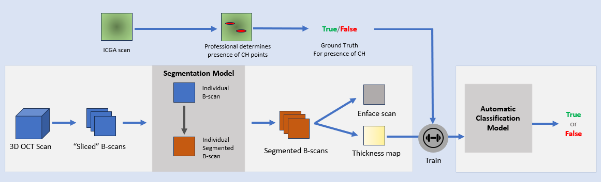

# Choroidal Segmentation and Hyperpermeability Classification

## Description
This repository contains the code and results for the master thesis titled "Choroidal Segmentation and Hyperpermeability Classification using OCT Scans." The thesis explores the development of a pipeline for accurate choroidal segmentation and automatic classification of choroidal hyperpermeability in Optical Coherence Tomography (OCT) scans.

## Dataset

The dataset used for training the segmentation models was composed using data provided by the Vitreous Macula and Retina Consultants of New York (VRMCNY) and the Nucleo Oftamologico de Almada (NOA). A total of 46 individual 15mm by 15mm OCT scans from 20 patients, both healthy and with Central Serous Chorioretinopathy (CSCR), with ages ranging from 36 to 83 from both sexes were used, with a median age of 53 years old. The following table, Table 1, contains the age and pathology distribution of the dataset collected and used in this work.

**Table 1: Distribution of pathologies and sexes of the scans used in the dataset**
| Pathology                | Male | Female |
|--------------------------|------|--------|
| CSCR NV (Neovascularized) | 2    | 1      |
| CSCR C (Chronic)          | 6    | 2      |
| PN (Pachychoroid Neovascularized) | 0 | 1      |
| PNN (Pachychoroid not vascularized) | 0 | 1      |
| Healthy                  | 4    | 3      |

The dataset used to train the models was composed of 120 OCT B-scan images manually segmented by specialists in ophthalmology from NOA. The validation/training split was 80%/20%.

## Evaluation Metrics

The challenge presented can be described as a binary semantic segmentation challenge; thus, the metrics used to assess the performance of the segmentation models were standard for such a challenge. In this work, we measured Sorensen–Dice coefficient (more commonly referred to as Dice), Recall, Pixel accuracy, and Precision.

## Methods
The project is implemented in Python using the PyTorch framework for deep learning. The segmentation models, including UNET, UNET++, DRUNET, and SegResNet, are implemented and trained to accurately segment the choroidal layer from OCT scans. The SegResNet architecture emerged as the most suitable for the task.

The thickness maps are generated using the SegResNet segmentation model. The maps are then classified for the presence of choroidal hyperpermeability using a ResNet-50-based classification model. The models are trained using a dataset composed of OCT scans from various pathologies, including healthy subjects, Central Serous Chorioretinopathy (CSCR) patients, and others.

## Architecture

*Figure 19: Schematic representation of the proposed architecture. The overall pipeline is divided into two components, a choroidal segmentation model and a choroidal hyperpermeability (CH) classification model. The first component intakes the three-dimensional OCT scan and through a multitude of transformations outputs an enface scan and a thickness map. The second section is trained for detecting CH using thickness maps with an ICGA scan taken to confirm the presence of ICGA and thus serving as ground truth label for training.*

## Results

| Model        | Dice Coefficient | Pixel Accuracy | Recall | Precision |
|--------------|------------------|----------------|--------|-----------|
| UNET         | 93.81            | 99.04          | 94.12  | 93.77     |
| UNET++       | 93.98            | 99.05          | 94.12  | 94.07     |
| DRUNET       | 94.27            | 99.11          | 94.04  | 94.66     |
| SegResNet    | 94.36            | 99.14          | 94.19  | 94.72     |

### Classification Results

| Metric          | Value (%)  |
|-----------------|------------|
| Accuracy        | 81.25      |
| True Positives  | 62.5       |
| True Negatives  | 100.0      |
| False Positives | 0.0        |
| False Negatives | 18.75      |

## Conclusion
The SegResNet architecture showed superior performance in choroidal segmentation, leading to high-quality thickness maps. The automatic classification model achieved satisfactory overall accuracy but struggled with false negatives in positive cases. Future work could explore 3D approaches for improved accuracy and better handling of the challenging cases.

## Data Usage and Patient Consent

All medical data exams used to train the model were obtained with explicit consent from the patients for research purposes under fair use. The data has been anonymized to protect patient privacy.

The medical imaging data used in this project were provided by Hospital Garcia da Orta and VRMCY. We express our gratitude to these institutions for their contribution to advancing medical research through the use of anonymized and consented data.

Feel free to explore the code and results in the corresponding folders.

## Research Paper

### [Widefield swept source optical coherence tomography for the monitoring of choroidal infiltrates](https://www.sciencedirect.com/science/article/pii/S2451993624001890?via%3Dihub#fig1)

Choroidal Infiltrates (Cis) detection is traditionally done using invasive imaging. We herein report the usage of topographic choroidal thickness maps (ChT maps) and en face swept-source Optical Coherence Tomography (OCT) as a rapid and non-invasive technique to monitor Cis in a patient with Chronic Lymphocytic Leukemia.

![Monitoring of choroidal infiltrates using the widefield swept-source Optical Coherence Tomography (OCT). (A) Fundus photography of the right eye at presentation shows multiple yellowish lesions at the posterior pole and nasal to the optic disk. (B) Widefield en face OCT slab at the choroid showed lesions with an oval shape distinct from choroidal vessels (yellow arrows). (C) Topographic choroidal thickness map (ChT map) shows multiples foci of increased choroidal thickness corresponding to the lesions seen in Fig. 1B (yellow arrows). (D) Cross-sectional OCT B-scan (yellow line at mosaic B) shows a homogenous internal pattern of the lesions overlying an area of increased transmission of the signal (yellow arrowheads). (D) Fundus photograph at follow-up (two weeks after the first evaluation) exhibits fading of choroidal lesions. The same inference was perceived with the analysis of en face OCT at the choroid (E), in the ChT map (F) and in the cross-sectional slab tracked with the prior exam (G).](resources/paper_img.png)

